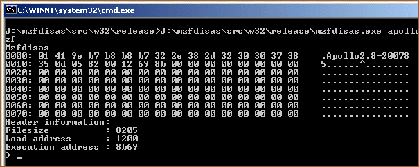
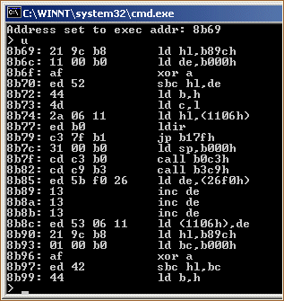
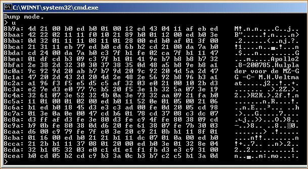
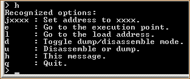

# MZF Disassembler
This is a utility for retrieving information from an MZF image.

For editing or assembling, see
[AS2MZF](http://www.sharpmz.org/mz-700/as2mzf.htm).

## Why interactive?
When disassembling a file, alignment can be a problem. Take the following code
for example:

    0000: c3 04 00                jp 0004h   ; jump to address 0004
    0003: 06                                 ; just a byte with value 06
    0004: 00                      nop        ; no operation

The disassembled code will look like this:

    0000: c3 04 00                jp 0004h   ; jump to address 0004
    0003: 06 00                   ld b,00    ; put 00 in register b

This problem is caused by the disassembler itself since it can not distinguish
data from code. To disassemble the example correctly the user should restart
the disassembly procedure from address `0004` in order to retrieve the `nop`
instruction.

## Installation
### Binaries
There are pre-compiled binaries for
[Linux](https://sharpmz.org/download/mzfdisas.zip) and
[Windows](https://sharpmz.org/download/mzfdisas32.zip). After unzipping the
archive, the binary for Linux can be found in `mzfdisas/src/linux/release`, for
Windows it can be found in `mzfdisas\src\w32\release`.

### From source
Retrieve the source code with Git.

    git clone https://github.com/jfjlaros/mzfdisas.git

To compile for Linux:

    cd mzfdisas/src/linux
    sh build.sh

For Windows, use:

    cd mzfdisas\src\w32
    build.bat

The binary will be placed in the `release` subdirectory.

## Usage
To start inspecting or disassembling an image named `image.mzf`, use the
following command:

    mzfdisas image.mzf

### Dump mode
Disassembly is not useful when inspecting data. Normally, a hex editor would
suffice, but since the ASCII table of the MZ is non-standard, a dump mode is
included in this program.

### Console
The console is used for user interaction.

When the program starts, the contents of the header and the addresses in the
header are displayed and a prompt (`> `) is shown. By typing `u`, one page of
code will be disassembled.

Type `d` to switch to dump mode and `u` to dump a page.

Typing `d` again will put the program back in disassemble mode.

The console recognises the following commands:

| command | description
|      --:|:--
|   jxxxx | Set the address pointer to xxxx.
|       e | Go to the execution address found in the header.
|       l | Go to the load address found in the header.
|       d | Toggle disassemble / dump mode.
|       u | Disassemble or dump one page.
|       h | Print a help message.
|       q | Quit.

Type `h` for help.

## Other features
All undocumented opcodes are implemented, as well as the duplicates. Inactive
opcodes will decode as a duplicate undocumented nop instruction.

Sources:

- [Undocumented opcodes](https://web.archive.org/web/20030415064150/http://www.geocities.com/SiliconValley/Peaks/3938/z80undoc.htm).
- [More undocumented opcodes](http://www.mdfsnet.f9.co.uk/Docs/Comp/Z80/UnDocOps).
